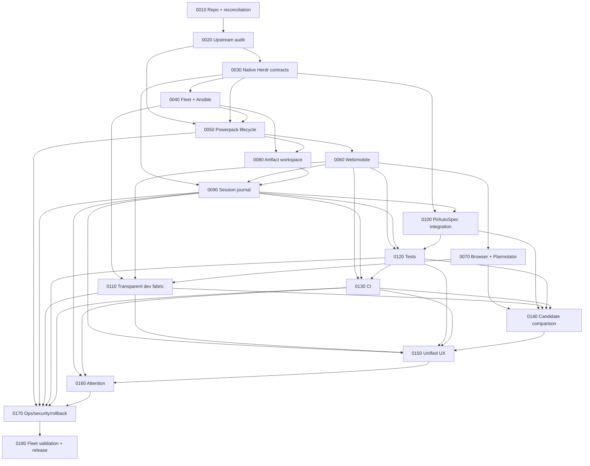

# Implementation Roadmap

The sequence is intentionally front-loaded with reconciliation, compatibility and stable contracts. UI layers are built only after the underlying ownership/data contracts are known.

## Milestone slices

### Milestone A — Trusted foundation (0010–0050)

Outcome: repository, real compatibility data, stable Herdr adapter, reproducible fleet and safely pinned Powerpack. Nothing flashy is required yet; this prevents later UI from being built on guessed APIs.

### Milestone B — Usable cockpit (0060–0100)

Outcome: phone/tablet access, browser/review, shared evidence, session search/timeline, and semantic Pi/AutoSpec correlation. At this point HerdR Engineering is already useful for daily operations.

### Milestone C — Distributed IDE (0110–0150)

Outcome: transparent dev services, cross-language tests, CI/queue state, parallel candidate comparison, coherent navigation. This is where “everything on every machine feels local” becomes tangible.

### Milestone D — Production operations (0160–0180)

Outcome: attention routing, robust security/observability/update/rollback and full fleet release validation.

## Parallelism policy

Implementation agents may work in parallel only when the manifest dependencies are satisfied and each agent owns an isolated Git worktree. Cross-phase interface changes require a written contract/ADR before dependent agents implement against them.
